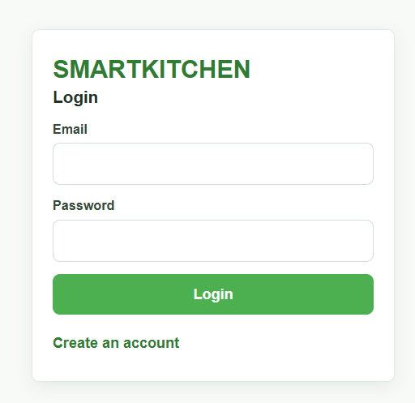
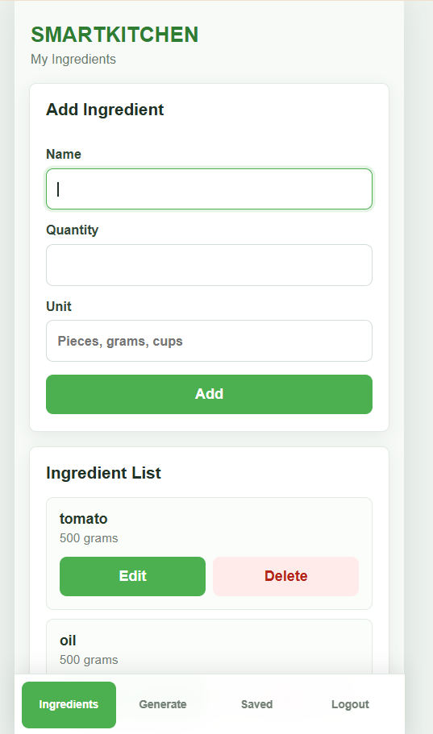
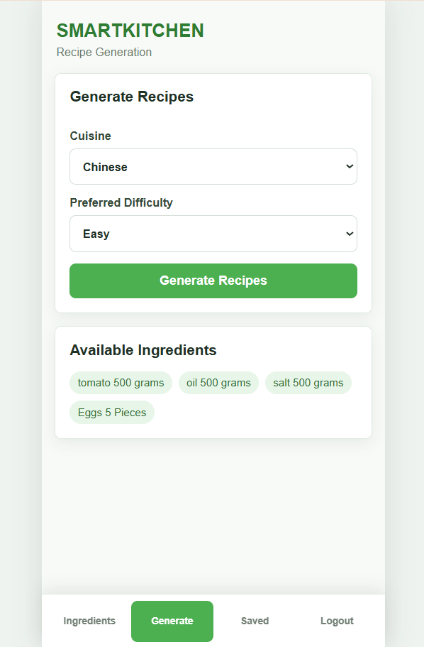
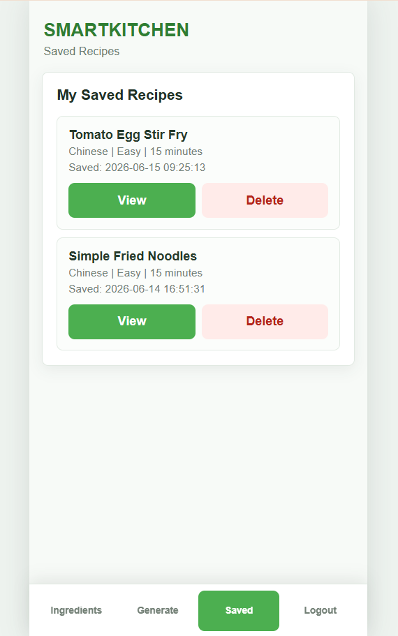
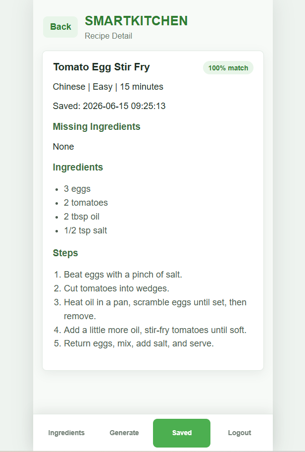

# SMARTKITCHEN

SMARTKITCHEN is a mobile-first, AI-powered cooking assistant that helps users decide what to cook with ingredients they already have. Users can manage their kitchen inventory, choose a cuisine and difficulty, generate recipes with DeepSeek, and save recipes for later.

## Target Users

- International students
- People living alone
- Beginner cooks
- People who are unsure what to cook
- Anyone who wants to make better use of available ingredients

## Key Features

- User registration and login
- Password hashing with bcrypt
- JWT-based authentication
- Personal ingredient management
- Add, edit, view, and delete ingredients
- Chinese and Western cuisine selection
- Easy, Medium, and Hard difficulty selection
- AI recipe generation with DeepSeek
- Recipe match scores and missing ingredient lists
- Save complete recipes to SQLite
- View and delete saved recipes
- Mobile-first interface with bottom navigation

## Tech Stack

### Frontend

- React
- Vite
- CSS

### Backend

- Node.js
- Express.js
- JWT
- bcrypt
- CORS
- dotenv

### Database

- SQLite

### AI

- DeepSeek API
- `deepseek-chat` model
- JSON-formatted recipe responses

## Screenshots

Replace these placeholder paths after adding screenshots to `docs/screenshots/`.

### Authentication



### Ingredient Management



### Recipe Generation



### Saved Recipes



### Recipe Detail



## Local Setup

### Prerequisites

- Node.js 18 or newer
- npm
- A DeepSeek API key

### 1. Clone the repository

```bash
git clone <repository-url>
cd SmartKitchen
```

### 2. Install backend dependencies

```bash
cd server
npm install
```

### 3. Configure backend environment variables

Create `server/.env`:

```env
DEEPSEEK_API_KEY=your_deepseek_api_key
JWT_SECRET=your_secure_jwt_secret
```

### 4. Start the backend

```bash
npm run dev
```

The backend runs at `http://localhost:5000`.

### 5. Install frontend dependencies

Open a second terminal:

```bash
cd client
npm install
```

### 6. Start the frontend

```bash
npm run dev
```

Open `http://localhost:5173` in a browser.

## Environment Variables

| Variable | Required | Description |
| --- | --- | --- |
| `DEEPSEEK_API_KEY` | Yes | Authenticates backend requests to the DeepSeek API. |
| `JWT_SECRET` | Yes | Signs and verifies user authentication tokens. |

Never commit real API keys or production secrets to source control.

## Current Limitations

- The frontend uses state-based navigation instead of URL routing.
- JWT tokens are stored in browser `localStorage`.
- Saved recipe duplicates are allowed.
- Recipe generation depends on DeepSeek availability and response quality.
- Generated recipes do not include images or nutritional information.
- The app currently supports only Chinese and Western cuisine preferences.
- There are no automated tests yet.

## Future Improvements

- Add secure production authentication and token handling
- Add expiry-date tracking and food-waste reminders
- Add shopping lists for missing ingredients
- Add calorie and nutrition analysis
- Add meal planning
- Add food and ingredient photo recognition
- Add recipe search, filtering, and duplicate detection
- Add automated frontend and backend tests
- Add deployment configuration and production environment settings

## Project Status

The current MVP supports the complete flow:

```text
Register/Login
-> Manage Ingredients
-> Generate Recipes
-> Save Recipe
-> View Saved Recipes
-> View Recipe Detail
```
